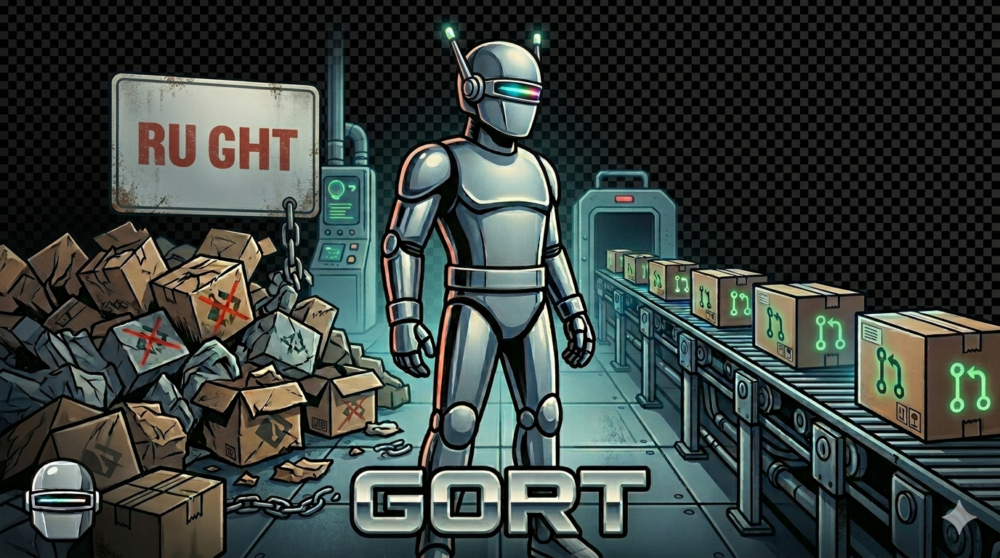

# GORT — GitOps Reconciliation Tool



[](https://github.com/clcollins/gort/actions/workflows/ci.yaml)
[](https://codecov.io/gh/clcollins/gort)

GORT closes the feedback loop after a merge to `main`. It watches for GitHub push events,
polls Flux until reconciliation completes, and if anything goes wrong it uses the Claude
API to analyze the failure and automatically opens a fix PR.

## Problem

After a merge to `main` there is no automated feedback loop verifying that Flux
successfully reconciled declared resources, or that the result matches the intent described
in `docs/` plan documents. Failed deployments require manual investigation of Flux status,
pod logs, and events — then manual authoring of a fix PR.

## How It Works

```text
GitHub push to main
       │
       ▼
GORT webhook handler (HMAC-validated)
       │  reads GitOpsWatcher CRDs to find matching apps
       ▼
Flux status polling (in-cluster, read-only K8s API)
       │  Kustomizations, HelmReleases, pods, logs, events
       ▼
       ├── Flux FAILURE ──► Claude API: analyze failure + plan docs
       │                               └──► GitHub API: open fix PR
       │
       └── Flux SUCCESS ──► Collect runtime state (pods, deployments, events)
                            └──► Claude API: validate intent vs plan docs
                                 ├── Intent MET: done
                                 └── Intent NOT MET ──► GitHub API: open fix PR
```

## Interface Extensibility

| Interface | Default | Extensible To |
| --- | --- | --- |
| `pkg/gitops.Client` | Flux CD | ArgoCD, Rancher Fleet |
| `pkg/vcs.Client` | GitHub | GitLab, Gitea |
| `pkg/ai.Client` | Claude (Anthropic) | OpenAI, Gemini, local LLMs |

## GitOps App Configuration (CRD)

GORT uses a `GitOpsWatcher` CRD to define which apps to watch:

```yaml
apiVersion: gitops.gort.io/v1alpha1
kind: GitOpsWatcher
metadata:
  name: cluster-config
spec:
  type: flux
  appName: cluster-config       # Flux Kustomization name
  namespace: flux-system        # Namespace where Flux resources live
  targetRepo: clcollins/cluster-config  # Watch pushes to this repo
  fixRepo: clcollins/cluster-config     # Open fix PRs on this repo
  docsPaths:
    - docs/plans/               # Where to find plan documents
  reconcileTimeout: 10m
```

## Observability

GORT runs two HTTP servers so that Prometheus scrape traffic is independent of webhook ingress:

| Port   | Purpose                       | Endpoints                                     |
| ------ | ----------------------------- | --------------------------------------------- |
| `8080` | Webhook (application traffic) | `POST /webhook`                               |
| `8081` | Metrics + health probes       | `GET /metrics`, `GET /healthz`, `GET /readyz` |

- **`/metrics`** — Prometheus metrics (port `8081`); scraped via the `ServiceMonitor` in `config/prometheus/`
- **`/healthz`** — liveness probe (port `8081`)
- **`/readyz`** — readiness probe (port `8081`)
- **Alertmanager** rules in `config/alerting/alerts.yaml`:
  - `FluxReconcileFailed` (critical)
  - `FluxReconcileTimeout` (warning)
  - `ResourceDeploymentFailed` (warning)
  - `FixPRCreationFailed` (warning)
  - `IntentNotMet` (warning)
  - `IntentValidationError` (warning)

## Documentation Convention

Every PR to this repository **must** include a plan document in `docs/plans/`.
CI enforces this. File naming: `NNNN-short-description.md`.

GORT follows the same convention when opening fix PRs on target repos.

## Development

### Prerequisites

- Go 1.24+
- Podman (or set `CONTAINER_SUBSYS=docker`)
- `markdownlint-cli2` (for markdown linting)

### Quick Start

```sh
# Run all checks
make all

# Run tests only
make test

# Build binary
make build

# Build container image (podman)
make image-build

# Build with docker instead
CONTAINER_SUBSYS=docker make image-build

# Generate CRD manifests
make manifests

# Generate DeepCopy methods
make generate
```

### Environment Variables

| Variable | Required | Default | Description |
| --- | --- | --- | --- |
| `GORT_WEBHOOK_SECRET` | yes | — | GitHub webhook HMAC secret |
| `GORT_GITHUB_TOKEN` | yes | — | GitHub personal access token (repo + PR scope) |
| `GORT_CLAUDE_API_KEY` | yes | — | Anthropic Claude API key |
| `GORT_CLAUDE_MODEL` | no | `claude-sonnet-4-6` | Claude model to use |
| `GORT_LISTEN_ADDR` | no | `:8080` | Webhook server listen address |
| `GORT_METRICS_ADDR` | no | `:8081` | Metrics + health probe server listen address |

## Project Layout

```text
cmd/gort/             — main entrypoint
internal/
  claudeai/           — Claude AI client (implements pkg/ai.Client)
  flux/               — Flux GitOps client (implements pkg/gitops.Client)
  github/             — GitHub VCS client (implements pkg/vcs.Client)
  k8s/                — Kubernetes client wrapper
  metrics/            — Prometheus metric definitions
  reconciler/         — Core reconcile orchestration (only non-pure package)
  webhook/            — HTTP webhook handler + pure parse functions
pkg/
  ai/                 — AI interface + types
  gitops/             — GitOps interface + types
  vcs/                — VCS interface + types
api/v1alpha1/         — GitOpsWatcher CRD Go types
config/
  crd/                — Generated CRD manifests
  rbac/               — ClusterRole + ClusterRoleBinding
  alerting/           — PrometheusRule manifest
  service/            — Kubernetes Service manifests (webhook + metrics)
  prometheus/         — ServiceMonitor for Prometheus Operator
docs/plans/           — Plan documents (required per PR)
hack/                 — Code generation scripts and headers
```

## License

This project is licensed under the [MIT License](LICENSE). Copyright © 2026 Christopher Collins.

**Note on AI-Generated Content:** This software was developed with the assistance
of AI tools. To the extent that any AI-generated content incorporated in this
software is protectable by copyright, the copyright holder asserts that such
content is covered by, and licensed under, the MIT License.

The legal status of AI-generated content with respect to copyright is unsettled.
This notice reflects the copyright holder's present intent and is subject to
revision as law and legal interpretation develop.
